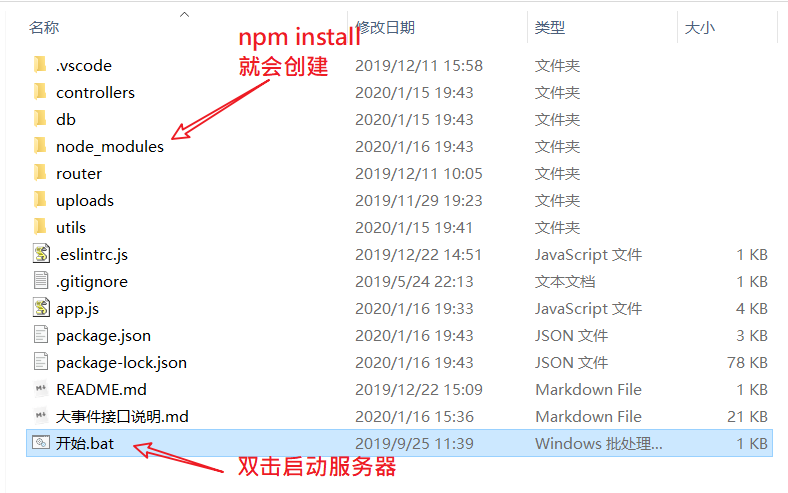

## 结构说明

- source 文件夹。完成后的代码
- initcode 项目初始代码。
- api_server文件夹。后端api接口服务器。


## 把本机设置为服务器

（前提：本机要安装nodejs）

步骤：

1. 把api_server下载到本地。`git clone  https://github.com/fanyoufu/bigevent`

2. 进入到 api_server目录下 `cd api_server`

3. 运行命令, 安装依赖  `npm i(或者是npm install)` 。由于服务器是采用express框架写的代码，所以要想跑api_server要先去下载一些必须的资源。如果完成就进行下一步。

   如果想获得更快的下载速度 可以 设置一下npm的镜像源为taobao。

   命令如下：

   ```bash
   # 设置镜像
   npm config set registry https://registry.npm.taobao.org
   # 再次安装
   npm i
   ```

   

   如果运行`npm i`时遇到如下的错误：

   

   可以试试先运行`npm cache clean --force`，然后再次`npm i` 

   ```bash
   # 清除npm缓存
   npm cache clean --force
   # 再次安装
   npm i
   ```

   

4. 把服务器跑起来。

   

方法一：双击 `开始.bat`

方法二：运行命令`node app.js`